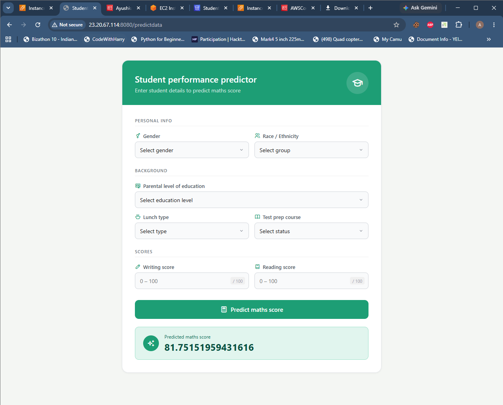

#  Student Performance Prediction

An end-to-end ML pipeline that predicts a student's **math score** based on their background and academic details — from raw data to a deployed web app.



---

##  Tech Stack

`Python` `Flask` `scikit-learn` `CatBoost` `XGBoost` `Pandas` `AWS Elastic Beanstalk`

---

## ⚙️ Pipeline Overview

| Step | What happens |
|---|---|
| Data Ingestion | Loads dataset, splits into train/test, saves artifacts |
| Data Transformation | `StandardScaler` + `OneHotEncoder` via `ColumnTransformer` |
| Model Training | Trains 8 models, picks best by R² score |
| Prediction | User input → preprocessor → model → predicted score |

---

## 📁 Project Structure

```
src/
├── components/
│   ├── data_ingestion.py
│   ├── data_transformation.py
│   └── model_trainer.py
├── pipeline/
│   ├── train_pipeline.py
│   └── predict_pipeline.py
├── exception.py
├── logger.py
└── utils.py
application.py        # Flask entry point
```

---

## 🖥️ Run Locally

```bash
git clone https://github.com/Ayushtechera/StudentPerformancePrediction-EndToEndMLPipeline.git
cd StudentPerformancePrediction-EndToEndMLPipeline
pip install -r requirements.txt
python application.py
```

Then open `http://localhost:8080`

---

## ☁️ Deployment

Deployed on **AWS Elastic Beanstalk** using `.ebextensions` config.

> EC2 instance has been shut down to avoid charges. Screenshot of the live app is attached above.

---

## 📊 Dataset

[Students Performance in Exams](https://www.kaggle.com/datasets/spscientist/students-performance-in-exams) — Kaggle

**Features:** gender, race/ethnicity, parental education, lunch, test prep course, reading score, writing score  
**Target:** math score

---

## 💡 What I Built / Learned

- Structured ML project beyond just a notebook
- Custom logging & exception handling
- Reusable sklearn `Pipeline` with serialized artifacts
- Flask web app + AWS EB deployment

---

**Ayush Kashyap** · [GitHub](https://github.com/Ayushtechera)